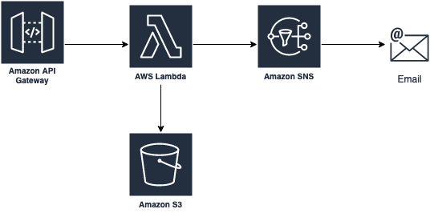

# ApiForwardEmail

This [aws-cdk](https://github.com/aws/aws-cdk) project creates an API gateway, saves the request into
an S3 bucket, and sends an email notifying the owner a request has been sent.



# Usage

To deploy it you need npm and aws-cdk installed.

```
git clone https://github.com/alexhnguyen/ApiForwardEmail.git
cd ApiForwardEmail
npm run build
cdk deploy
```

After you deploy it you can see the URL of the API Gateway in the output

```
 ✅  ApiForwardEmailStack

Outputs:
ApiForwardEmailStack.ApiGatewayApiGatewayApiGatewayEndpointA04E016A = https://gbjlw62792.execute-api.us-west-2.amazonaws.com/prod/
```

To send a request to the API, you can use the [send_post.py](./send_post.py) file as a template.
